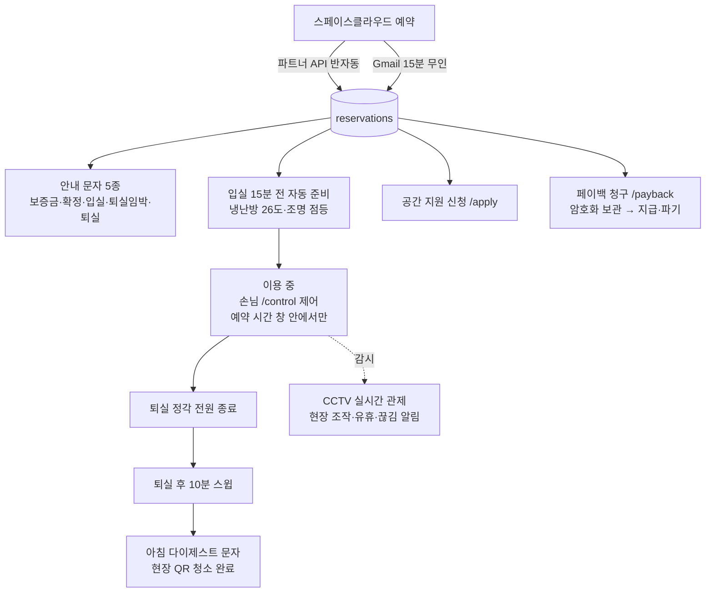

# 타입라운지 무인 운영 시스템 PRD

- 소요 기간: 2026-08-03 ~ 2026-08-14 (운영 시스템 구축 구간, PR #2~#80)
- 문서 생성일: 2026-08-14
- 담당자: 형운 (hyungwoon)

> **이 문서는 역기획(reverse-PRD)이다.** 이미 라이브인 시스템(`typelounge.vercel.app`)을 코드·마이그레이션·운영 문서에서 역으로 정리했다. 모든 인수 조건(AC)은 현재 구현이 실제로 보장하는 동작이며, Additional Details에 근거 파일을 남긴다. 미구현·미검증 항목은 AC에 넣지 않고 Future Work와 각 스토리의 Additional Details에 분리했다.

## Background

타입라운지는 합정역 인근 3층, 전용 52.49㎡의 멀티유즈 라운지다(회의실 / 촬영 스튜디오 / 파티룸). 판매는 스페이스클라우드 단일 채널이고, **현장에 상주 인력이 없다.**

상주 없이 공간을 팔면 세 가지 문제가 바로 생긴다.

1. **예약이 우리 손에 없다.** 예약·취소는 스페이스클라우드에만 존재한다. 우리 DB에 없으면 기기 자동화도, 안내 문자도, 청소 스케줄도 시작 자체가 안 된다. 파트너 API는 비공식이고 토큰 수명이 24시간이라 완전 무인화가 불가능하다는 실측(2026-08-04)이 있다.
2. **현장 개입 없이 공간이 돌아가야 한다.** 손님 입장 전에 냉난방이 켜져 있어야 하고, 퇴실 후엔 꺼져야 하며, 손님이 조명·냉난방을 스스로 만질 수 있어야 한다. 이 모든 것이 실패했을 때 사람이 현장에 없으므로, 실패는 원격에서 보여야 한다.
3. **법정 의무가 무인이라고 면제되지 않는다.** CCTV는 「개인정보 보호법」 §25의 고지 의무와 §25⑤의 녹음 금지가 걸리고, 지원금 지급을 위한 주민등록번호 수집은 §24-2가 암호화를 강행 규정으로 요구한다.

2026-08-03 어드민·예약 자동화 착수부터 2026-08-14까지 80개 PR로 구축했고, 현재 손님을 받으며 라이브로 돌고 있다. 이 문서는 그 라이브 시스템의 요구사항 정본이다.

## Goal

| 지표 | 현재 | 목표 |
| --- | --- | --- |
| 현장 상주 인력 | 0명 (무인 운영 중) | 0명 유지 |
| 예약 반영 지연 (백업 경로 기준) | 최대 15분 (Gmail 트리거 주기) | 15분 이내 유지 |
| 예약 반영 누락 | 이중 경로(API+Gmail)로 방어, 일 1회 감사 | 누락 0건 유지 |
| 자동화 정지 미인지 시간 | 최대 10분 (워치독 판정 기준) | 10분 이내 유지 |
| 가동률·매출 등 사업 지표 | 계측 없음 | [확인 필요: 지표 정의와 측정 도구가 정해지지 않았다] |

## Hypothesis

> 스페이스클라우드의 예약·취소를 우리 DB(`reservations`)에 자동 반영하면, 기기 자동화·안내 문자·청소 안내가 "예약"이라는 단일 사실 위에서 사람 없이 돌아갈 것이다.

> 손님 제어를 비밀번호가 아니라 **예약 시간 창**으로 서버가 자르면, 게이트 없이도 안전하다 — 현관 비밀번호가 이미 가이드에 평문 공개라 게이트는 애초에 장벽이 아니었다.

> 실패를 조용히 삼키지 않고 장부(status 컬럼)와 Mattermost 알림으로 드러내면, 상주 없이도 문제를 원격에서 발견하고 복구할 수 있을 것이다.

## Principles

- **권한은 서버가 자른다.** 클라이언트에서 버튼을 감추는 것은 방어가 아니다. 역할(admin/guest/cleaner)별 허용 action·command를 서버(`auth.ts`)가 강제한다.
- **'모름'과 '꺼짐'을 합치지 않는다.** `power = null`을 `'OFF'`로 뭉개면 냉난방이 밤새 도는 상황이 조용히 숨는다. 같은 이유로 상태 테이블의 `updated_at`에 기본값을 주지 않는다.
- **실패는 조용히 사라지지 않는다.** 발송·명령·자동화의 실패는 장부 행(status)과 Mattermost 알림으로 남는다. 자동화 자체의 정지는 자동화 밖(워치독)이 감시한다.
- **오디오는 서버에 들이지 않는다.** 카메라를 MediaMTX에 직결하지 않고, 오디오를 떼는 ffmpeg `-an` 재발행이 유일 경로다(§25⑤ 녹음 금지).
- **주민번호·계좌는 평문으로 존재하지 않는다.** 암호화는 DB가 아니라 Edge Function이 하고, 키는 DB 밖 시크릿에만 둔다. DB가 통째로 새도 주민번호는 안 샌다.
- **같은 사실은 한 곳에서만 만든다.** MQTT 토픽 문법·문자 문구·설치 절차·보관기간처럼 여러 곳이 봐야 하는 값은 단일 출처를 정하고 나머지는 참조한다.
- **유료 발송은 중복 도달보다 미발송이 낫다.** 결과 불명(unknown)은 실패로 되돌리지 않고 자리를 막아 자동 재시도를 멈춘다 — 유실은 알림으로 드러난다.
- **손님에게 한 약속은 시스템이 지킨다.** 보관기간처럼 손님에게 고지한 숫자는 고지문·안내판·설정·시크릿이 같은 값이어야 하며, 어긋남이 발견되면 문서화하고 해소한다.

## Scope

### Requirements

- [x] 스페이스클라우드의 예약·취소가 사람 개입을 최소로 우리 DB에 반영된다 (주 경로: 파트너 API 반자동 / 백업 경로: Gmail 15분 무인)
- [x] 손님이 이용에 필요한 안내(오시는 길·현관 비밀번호·기기 사용법·이용 규칙·CCTV 법정 고지)를 웹 가이드와 예약별 자동 문자로 받는다
- [x] 손님이 자기 예약 시간 안에서 비밀번호 없이 조명·냉난방을 제어한다
- [x] 예약을 기준으로 기기가 자동 준비·종료되고, 이상 상황(현장 조작·유휴 가동·연결 끊김·자동화 정지)이 알림으로 드러난다
- [x] CCTV 3대를 어드민에서 원격 실시간 관제하고, 법정 고지와 녹음 금지를 지킨다
- [x] 청소 담당자가 아침 안내 문자와 현장 QR만으로 청소 루프를 돈다 (어드민 접근 불필요)
- [x] 공간 지원 신청과 지원금(페이백) 청구를 공개 폼으로 받고, 어드민이 심사·지급·반려를 처리하며, 주민번호는 암호화 보관·기한 파기로 다룬다
- [x] 어드민·손님·청소 세 역할의 권한을 서버가 자르고, 비밀번호 공격은 시도 제한으로 막는다

### Non-Requirements

- **서버 녹화·되감기를 하지 않는다.** 2026-08-10 서버 녹화를 껐다(`record: no`). 영상은 카메라 SD카드에만 남고, SD 보관은 감사 범위 밖이다(오너 결정 2026-08-13, 경계는 '우리 서버'). 어드민 되감기 UI도 제거했다(#63).
- **오디오를 수집하지 않는다.** §25⑤ 녹음 금지 — `-an` 재발행으로 제거하고, 오디오 트랙 감지 시 어드민에 경고한다.
- **자체 예약 접수·결제를 만들지 않는다.** 판매 채널은 스페이스클라우드 단일이고, 우리 DB는 그 사본이다.
- **회원 계정·회원가입이 없다.** 손님 인증은 예약 시간 창, 어드민은 공용 비밀번호 1개, 청소는 QR 토큰이다.
- **손님 제어 페이지에 비밀번호 게이트를 두지 않는다.** 의도적 제거(#22) — 현관 비밀번호가 이미 사이트에 평문 공개라 게이트가 장벽이 아니었고, 권한은 서버(`auth.ts`)가 자른다.
- **페이백에서 리뷰 캡처 이미지를 받지 않는다.** 파기 대상이 하나 더 늘고 SQL 크론이 Storage를 못 지운다 — 리뷰는 자기보고로 받고 사람이 대조한다.
- **주민번호 체크섬 검증을 하지 않는다.** 2020-10-06 이후 발급분은 체크섬 규칙이 없어 막힌다 — 자릿수·성별코드·생년월일 실재성만 검사한다.
- **12시간 지원 상한을 코드로 강제하지 않는다.** 예약이 스페이스클라우드에서 일어나 우리 DB를 지나지 않으므로, 문구로 알리고 사람이 이름·연락처로 대조한다.
- **카메라 팬틸트(회전) 제어를 하지 않는다.** 고지한 촬영 범위 밖을 비추는 조작 경로를 만들지 않는다.
- **공제 세액을 저장하지 않는다.** 3.3%는 조회 시점 계산 — 세율이 바뀌면 과거 행의 뜻이 달라지기 때문이다.

### Future Work

- [x] **어드민 게이트 로그인에 시도 제한 적용** — 시도 제한이 Edge Function 3곳(control·claim·apply)에만 배선돼 있고 게이트가 직접 부르는 PostgREST RPC 경로는 밖이었다. **2026-08-14 해소**: `20260814150000_admin_check_throttle.sql`이 검증 뿌리 `admin_check`에 같은 규칙(10분/10회 · cf-connecting-ip · 실패만 카운트 · fail-open)을 얹었다. 실효는 해시 전환이 라이브에 적용된 뒤부터다.
- [x] **비밀번호 회전 완료** — **2026-08-14 완료.** 새 비밀번호 심기 → Edge 시크릿 교체 → 전환·회수 마이그레이션(`20260813111000`·`111100`·`20260814150000`) push → functions deploy. 옛 평문 PIN 은 SQL·Edge 양 경로에서 무효화됐고(실측), 그에 따라 US-8.3 의 시도 제한도 네 번째 표면(PostgREST RPC)에서 실효한다. 게이트 입력칸은 그전에 이미 해소됐다(#83).
- [ ] **CCTV 손님 고지 문구 정합** — 게스트 가이드는 "24시간 연속 촬영·녹화 / 보관 7일 자동 파기"라고 약속하지만 서버는 저장하지 않고, SD카드는 순환 덮어쓰기라 7일이 보장값이 아니다. 문구를 실제(SD 보관)로 고치거나 서버 녹화를 되살려 약속을 복원한다.
- [ ] **CCTV 현장 안내판 부착 + 스페이스클라우드 리스팅 고지** — 웹 가이드는 이미 예약한 사람만 본다. §25 고지는 예약 전 접점에도 필요하다.
- [ ] **어드민 청소 토글의 출처 기록** — QR 경로는 `cleaning_done_source`를 남기지만 어드민 한 건 토글은 null로 남는다(마이그레이션에 후속 과제로 기록됨).
- [ ] **조명 `online` 판정 정밀화** — retained LWT를 '지금 접속 중'으로 읽어 브로커 재시작 시 죽은 기기가 "연결됨"으로 보인다(2026-08-11 실측).
- [ ] **연결 끊김·시스템 오류 알림 실기기 검증** — 2026-08-12 추가분은 `deno test`만 통과, 전원 뽑기·에이전트 kill·60분 억제 3단계 실검증이 남아 있다.
- [ ] **페이백 보유기간(1년)의 세무 확인** — 형운 결정(2026-08-10)이지 세법이 정한 값이 아니다.
- [ ] **청소 QR의 인앱 브라우저(카카오톡·네이버) 프래그먼트 생존 확인** — `#t=` 토큰이 떨어지면 페이지가 동작하지 않는다.
- [ ] **`mark_paid`·`reject`의 상태 가드** — 서버가 id로만 필터해, 이미 지급된 건에 반려를 부르면 암호문이 지워진다(현재 방어는 화면의 버튼 렌더 조건뿐).
- [ ] **공개 신청 폼의 서버측 중복 제출 방어** — 현재는 스팸 덫과 클라이언트 전송 중 플래그뿐이다.
- [ ] **`ux.md` 작성** — 브랜드북 3종(brand·bx·product) 중 앱·무인 자동화 UX 문서만 없다.

## User Story

### EPIC 1 — 예약 수집·관리

#### US-1.1 파트너 API 예약 동기화 (주 경로)
> 운영자는 브라우저 콘솔에서 스페이스클라우드 파트너 API 동기화를 돌려 미등록 예약을 한 번에 DB에 넣는다.

| ID | 인수 조건 |
| --- | --- |
| AC-1 | `scSync.run(비밀번호)`를 실행하면 예약번호로 대조해 미등록 건만 `admin_add_reservation`으로 등록되고, 스클에서 취소 상태로 바뀐 건은 취소 처리된다. |
| AC-2 | API의 `end_hour`는 포함값이므로 종료 시각이 +1시간으로 보정되어 저장된다 (16–18 → 16:00~19:00). |
| AC-3 | 같은 동기화를 여러 번 돌려도 결과가 같다 — 이미 등록된 예약번호는 건너뛴다. |
| AC-4 | 파트너 토큰은 브라우저 `localStorage`에, 어드민 비밀번호는 콘솔 인자로만 다룬다 — 코드에 박지 않는다. |
| Prototype or Design | 없음 (브라우저 콘솔 도구) |
| Additional Details | 근거: `06-applications/automation/spacecloud-api-sync.js:158-210`. 토큰 수명이 정확히 24시간이고 리프레시가 없어 완전 무인화 불가(2026-08-04 실측) — 그래서 "반자동이 상한"이며 무인 백업은 US-1.2가 맡는다. |

#### US-1.2 Gmail 백업 동기화 (무인)
> 시스템은 스페이스클라우드 알림 메일을 15분마다 파싱해, 사람 없이 예약을 등록하고 취소를 반영한다.

| ID | 인수 조건 |
| --- | --- |
| AC-1 | "예약 완료" 메일 도착 후 15분 안에 예약이 DB에 등록되고 Mattermost 알림이 간다. |
| AC-2 | 메시지는 도착 시각 오름차순으로 처리되어, 취소가 등록보다 먼저 처리되는 순서 역전이 없다. |
| AC-3 | 예약번호 추출에 실패하면 조용히 null로 넣지 않고 에러로 승격된다 — unique 인덱스가 null을 못 막아 중복이 생기기 때문이다. |
| AC-4 | 처리 실패는 메시지 단위로 3회까지 조용히 재시도하고, 소진하면 메일+Mattermost로 1회 알린 뒤 포기로 기록한다. |
| AC-5 | 동시 실행은 잠금(`LockService`) 획득 실패 시 즉시 종료로 막는다. |
| Prototype or Design | 없음 (Apps Script 무인 실행) |
| Additional Details | 근거: `06-applications/automation/spacecloud-gmail-sync.gs:57-107,130,192-196`. 일 1회 감사가 백업 경로 신선도(3일)를 경보한다(`:553-587`). |

#### US-1.3 취소 반영
> 시스템은 취소를 삭제가 아닌 상태 변경(`cancelled=true`)으로 반영하고, 애매하면 사람을 부른다.

| ID | 인수 조건 |
| --- | --- |
| AC-1 | 취소 메일이 오면 해당 예약이 `cancelled=true`가 되고 알림이 간다 — 행은 지워지지 않는다. |
| AC-2 | 취소 메일에는 예약번호가 없으므로 (날짜+시작+종료) 후보를 예약자명으로 특정한다. |
| AC-3 | 이미 취소된 동명 후보가 있으면 활성 행을 건드리지 않는다 (같은 메일 재처리 방어). |
| AC-4 | 그 상태에서 동명 활성 행까지 있으면 판별 불가로 보고 자동 처리 대신 Mattermost로 사람을 부른다. |
| AC-5 | 같은 사람이 취소→재예약→다시 취소하면 두 번째 취소는 자동 반영되지 않는다 — 재처리와 구분할 수 없어 안전한 쪽을 택한 한계이며, 감사(US-1.2)와 수동 대조로 보완한다. |
| Prototype or Design | 없음 |
| Additional Details | 근거: `spacecloud-gmail-sync.gs:282-337`, `supabase/migrations/20260813111000_admin_use_secret.sql:33-47`. 캘린더 칩에서는 취소건이 제외되고 날짜 목록에 '취소됨' 배지로 남는다(`admin.html:926`). |

#### US-1.4 연락처·이메일 백필
> 운영자는 메일 경로로 못 받은 연락처·이메일을 파트너 API에서 받아 빈 칸만 채운다.

| ID | 인수 조건 |
| --- | --- |
| AC-1 | `scSync.fillContacts()`는 이미 값이 있는 칸을 덮지 않아 몇 번을 돌려도 결과가 같다. |
| AC-2 | 취소건은 API가 이름을 마스킹하고 연락처를 주지 않으므로, 확정 시점에 못 받았으면 백필로도 받을 수 없다. |
| Prototype or Design | 없음 |
| Additional Details | 근거: `spacecloud-api-sync.js:227-256`, `supabase/migrations/20260803020000_admin_fill_contact.sql:29-33`. 스클 메일에는 연락처·이메일이 없다는 사실이 코드 주석으로 남아 있다(#4). |

#### US-1.5 어드민 예약 관리
> 운영자는 월 캘린더와 날짜별 목록에서 예약을 보고, 수동 추가·삭제와 입실·퇴실·청소 상태 체크를 한다.

| ID | 인수 조건 |
| --- | --- |
| AC-1 | 월 캘린더는 날짜별 칩(최대 2개 + `+N`)을 보여주고, 날짜를 고르면 그날의 예약 카드 목록이 뜬다. |
| AC-2 | 새 예약 추가는 이용 날짜·시작·종료·예약자명이 필수이고, 성공하면 그 날짜로 캘린더가 이동한다. |
| AC-3 | 삭제는 확인창을 거쳐 행을 실제로 지운다 — 스클 취소 반영(상태 변경)과 다른 동작임이 구분된다. |
| AC-4 | 입실 안내·퇴실 안내·청소 완료를 카드에서 버튼으로 표시한다. |
| AC-5 | RPC 실패는 조용히 넘어가지 않고 alert/오류 문구로 드러나며, 자동 재시도는 없다 — 사람이 다시 누른다. |
| Prototype or Design | 라이브: `typelounge.vercel.app/admin` |
| Additional Details | 근거: `06-applications/admin.html:891-1092,1127`. 라이브 DB에 테스트 예약을 만들면 기기 자동화가 실제로 발화한다 — 2026-08-08 이용 중 손님의 설정을 덮은 사고가 있어 금지 규칙이 됐다. |

#### US-1.6 이용 시간 수정
> 운영자는 예약 시간을 수정하고, 연장하면 퇴실 자동화와 퇴실 문자가 함께 따라온다.

| ID | 인수 조건 |
| --- | --- |
| AC-1 | 퇴실 시각을 바꾸면 퇴실 문자 2종(checkout_soon·checkout)이 `superseded`로 내려가고, 퇴실 자동화 실행 표시가 풀려 새 시각에 다시 돈다. |
| AC-2 | 종료가 시작보다 이르면 "다음 날 퇴실"로 한 번 더 확인받는다 — 자정 넘김 예약을 정식 지원한다. |
| AC-3 | 시작과 종료가 같은 값이면 거부된다. |
| AC-4 | 입실 준비 자동화는 재실행되지 않는다 — 이미 지나간 준비를 다시 돌리지 않는다. |
| Prototype or Design | 라이브: `/admin` 시간 수정 모달 |
| Additional Details | 근거: `supabase/migrations/20260813113000_reservation_time_overnight.sql:19-68`, `admin.html:1340-1384,614-617`. |

### EPIC 2 — 손님 안내 (가이드·문자)

#### US-2.1 게스트 가이드 열람
> 손님은 웹 가이드 한 페이지에서 오시는 길·현관 비밀번호·기기 사용법·시설·이용 규칙·CCTV 고지·문의처를 확인한다.

| ID | 인수 조건 |
| --- | --- |
| AC-1 | 가이드(`/`)에 현관 비밀번호와 와이파이 접속 정보가 평문으로 안내된다 — 예약자만 이 페이지를 받는 전제다. |
| AC-2 | 조명은 제어 페이지(`/control`) 또는 현장 QR로 안내되고, 벽 스위치 수동 조작 시 복구 비용 청구가 경고된다. |
| AC-3 | 시설(TV·스피커·냉난방 리모컨)과 출입 제한 구역(스태프룸·발코니)이 안내된다. |
| AC-4 | CCTV 법정 고지 섹션이 있다 (상세는 US-5.4). |
| Prototype or Design | 라이브: `typelounge.vercel.app` |
| Additional Details | 근거: `06-applications/guest-guide.html:132-307`. |

#### US-2.2 안내 문자 자동 발송
> 손님은 예약 흐름에 맞춰 안내 문자(보증금·예약 확정·입실·퇴실 임박·퇴실)를 자동으로 받는다.

| ID | 인수 조건 |
| --- | --- |
| AC-1 | 어드민이 자동발송을 켜면 그 클릭 안에서 첫 통(보증금 필요 시 보증금, 아니면 예약 확정)이 나간다. |
| AC-2 | 이후 입실 10분 전·퇴실 15분 전·퇴실 정각에 1분 주기 자동화가 문자를 보낸다 (허용 유예 30/15/60분). |
| AC-3 | 발송 전에 장부(`reservation_sms`)에 `sending` 행을 선점하고, 유니크 위반이면 발송하지 않는다 — 같은 종류가 두 번 나가지 않는다. |
| AC-4 | 이미 입실 시각이 지난 뒤 자동발송을 켜면 첫 통을 보내지 않고 `expired`로 남긴다 — 입실한 손님에게 뒷북 문자를 보내지 않는다. |
| AC-5 | 취소된 예약에는 수동 발송도 자동발송 켜기도 400으로 거부된다. |
| Prototype or Design | 문구 정본: `supabase/functions/control/sms/templates.ts` (시안: `_sms-templates.html`) |
| Additional Details | 근거: `supabase/functions/control/handlers/sms.ts:123-146`, `sms/schedule.ts:37-41`, `sms/dispatch.ts:74-84`. 퇴실 문자의 "바로 다음 시간에 예약하신 분이 계셔서"는 사실이 아닐 수 있는 채로 항상 들어간다(퇴실 압박 목적, 형운 결정 2026-08-08). |

#### US-2.3 어드민 문자 관리
> 운영자는 예약 카드에서 보증금 여부·자동발송을 토글하고, 종류별로 문구 확인·수동 발송·발송 이력 확인을 한다.

| ID | 인수 조건 |
| --- | --- |
| AC-1 | 예약 카드의 문자 박스에 5종 각각의 상태와 [보내기]·[문구] 버튼이 보인다. |
| AC-2 | 이미 보낸 종류는 버튼이 [다시]로 바뀌고, 한 번 더 눌러야 재발송된다 — 실수 한 번으로 중복 발송되지 않는다. |
| AC-3 | [문구]는 서버가 만든 실제 발송 문구를 받아 복사할 수 있고, 직접 보낸 경우 [보냈어요]로 장부에 수동 발송을 남긴다. |
| AC-4 | 연락처를 나중에 입력하면, 자동발송이 켜져 있던 예약은 저장 직후 못 나갔던 첫 통이 나간다. |
| AC-5 | 문자 작업 중 목록 갱신이 실패해도 버튼 잠금은 반드시 풀린다 — 잠긴 채 남아 재클릭·중복 발송을 유발하지 않는다. |
| Prototype or Design | 라이브: `/admin` 예약 카드 문자 박스 |
| Additional Details | 근거: `admin.html:1208-1302,1429-1496`. 문자 미리보기(`sms_preview`)조차 admin 전용이다 — 문구에 예약 일시(공실 정보)가 들어가기 때문(`handlers/sms.ts:5-7`). |

#### US-2.4 발송 실패·예외 처리
> 시스템은 발송 실패를 유형별로 갈라 장부에 남기고, 유료 문자가 중복 도달하지 않는 쪽으로 실패한다.

| ID | 인수 조건 |
| --- | --- |
| AC-1 | 확정 거절(4xx·건별 거절)만 `failed`로 남아 다음 틱이 자동 재시도한다. |
| AC-2 | 결과 불명(타임아웃·네트워크 예외·5xx)은 `unknown`으로 자리를 막아 자동 재시도를 멈춘다 — 유료 LMS가 두 번 도달하는 것보다 안 가는 편이 낫고, 유실은 알림으로 드러난다. |
| AC-3 | 연락처가 없으면 `no_phone`으로 자리를 막고 1회만 알린다 — `failed`로 적으면 유예창 내내 매분 알림이 도배된다. |
| AC-4 | 발송 창을 놓친 건은 `expired`로 장부와 채널에 남고 이후 자동 발송에서 제외된다. |
| AC-5 | 010 번호는 11자리로 정규화하고, 유선·050 안심번호는 발송 대상에서 제외한다. |
| Prototype or Design | 없음 |
| Additional Details | 근거: `supabase/migrations/20260813120000_sms_unknown_status.sql:20-24`, `sms/solapi.ts:52-62,133-177`, `sms/dispatch.ts:111-169`. SOLAPI 미설정 시 자동 경로는 장부에 아무것도 안 적고, 어드민 요청은 503이다. |

### EPIC 3 — 공간 제어 (손님·어드민)

#### US-3.1 손님 제어 접근 — 예약 시간 창
> 손님은 비밀번호 없이 제어 페이지에 들어가되, 서버가 자기 예약 시간 안에서만 제어를 연다.

| ID | 인수 조건 |
| --- | --- |
| AC-1 | 예약 시간 밖에는 손님의 조회·명령이 전부 403(`outside_reservation_window`)이고, 페이지는 컨트롤을 숨긴 안내 화면이 된다. |
| AC-2 | 판정은 취소되지 않은 예약의 `[시작, 종료)` 반열린 구간이며, 별도 사전 개방 시간 없이 시작 정각부터 열린다. |
| AC-3 | 자정을 넘기는 예약(예: 22:00~02:00)도 열린다 — 서버가 어제 날짜 예약을 함께 조회한다. |
| AC-4 | 창 밖 화면에서도 폴링은 유지되어, 시작 시각이 되면 새로고침 없이 자동으로 열린다. |
| AC-5 | 예약 조회가 실패하면 닫힘으로 처리된다(fail-closed). |
| Prototype or Design | 라이브: `typelounge.vercel.app/control` |
| Additional Details | 근거: `supabase/functions/control/reservation-window.ts:47-62`, `index.ts:107-109`, `guest-control.html:250-269,313-317`. 자동화(`automate`)만 이 게이트를 예외로 통과한다 — 예외가 빠진 배포로 자동화가 두 번 죽었다(#44·#70). |

#### US-3.2 손님 조명·냉난방 제어
> 손님은 전체 켜기/끄기·나이트모드·기기별 전원·온도·모드·바람 세기를 조작한다.

| ID | 인수 조건 |
| --- | --- |
| AC-1 | 전체 끄기만 확인창을 받는다 — 켜기는 바로 실행된다. |
| AC-2 | 나이트모드는 무드 조명 구성(SiHAS 계열 소등, 나머지 점등)으로 바꾸고 냉난방은 건드리지 않는다. |
| AC-3 | 온도는 −/+ 1도 단위와 직접 입력을 지원하고, 기기 프로파일의 범위·단위로 잘라(clamp+snap) 전송한다. 직접 입력은 포커스 이탈 시에만 전송되어 중복 전송이 없다. |
| AC-4 | 모드·바람은 기기 프로파일 enum 값 그대로 전송하고 라벨만 한글로 보여준다. |
| AC-5 | 전체 명령 중 일부 기기가 실패하면 나머지는 계속 실행하고 실패한 이름만 모아 안내한다. |
| AC-6 | 손님 응답에서는 기기 주소(ThinQ deviceId·MQTT 토픽)가 제거된다. |
| Prototype or Design | 라이브: `/control` |
| Additional Details | 근거: `guest-control.html:361-453,481-543,564-589`, `auth.ts:143`. 손님이 쓸 수 있는 명령은 서버 허용 목록(`GUEST_COMMANDS`) 5종뿐이다. |

#### US-3.3 어드민 기기 제어·등록
> 운영자는 기기 카드로 제어하고, ThinQ 냉난방·Tasmota 조명을 등록·해제한다.

| ID | 인수 조건 |
| --- | --- |
| AC-1 | 냉난방 등록은 ThinQ 계정의 기기 목록에서 고르고, 서버가 벤더 프로파일을 읽어 제어 가능 축(전원·온도·모드·바람)과 제약을 파생·저장한다. |
| AC-2 | 조명 등록은 MQTT 토픽 세그먼트를 받되, 와일드카드(`+`/`#`)·`/`·32자 초과를 등록 시점에 거부한다 — 잘못된 토픽으로 조명 전체가 한꺼번에 반응하는 사고를 막는다. |
| AC-3 | 같은 (어댑터, 주소) 중복 등록은 "이미 등록된 기기"로 거부된다. |
| AC-4 | 기기가 지원하지 않는 명령(capabilities에 없는 축)은 400으로 거부된다. |
| AC-5 | 15초 폴링 중에도 명령 진행 중이거나 입력에 포커스가 있으면 화면을 다시 그리지 않는다 — 입력 중인 값이 날아가지 않는다. |
| Prototype or Design | 라이브: `/admin` 공간 제어 탭 |
| Additional Details | 근거: `supabase/functions/control/handlers/registry.ts:38-90`, `tasmota/topics.ts:44-57`, `handlers/command.ts:33-35`, `admin.html:2081-2140`. ThinQ 프로파일은 문서 예시가 아니라 실기기 값으로 파생한다 — 세 군데가 달랐던 실측이 근거다. |

#### US-3.4 기기 상태 표시
> 이용자는 기기의 켜짐/꺼짐/모름, 연결 상태, 마지막 보고 시각을 구분해서 본다.

| ID | 인수 조건 |
| --- | --- |
| AC-1 | `power=null`은 '상태 모름'으로 표시된다 — '꺼짐'과 합쳐지지 않는다. |
| AC-2 | 한 번도 보고가 없던 기기(`updated_at=null`)는 "아직 상태를 받은 적 없어요"로, 오래된 보고(600초 초과)와 구분된다. |
| AC-3 | ThinQ 조회가 실패하면 마지막 캐시를 유지한 채 `연결 끊김`으로만 표시한다 — 꺼졌다고 단정하지 않는다. |
| AC-4 | 명령 4초 뒤 지연 재조회로 조명 반영을 따라잡고, 탭이 보일 때만 30초 폴링한다. |
| Prototype or Design | 라이브: `/control`·`/admin` |
| Additional Details | 근거: `guest-control.html:219-220,285-296,345-359`, `types.ts:66-80`, `handlers/list.ts:56-60`. |

### EPIC 4 — 예약 기반 자동화·감시

#### US-4.1 입실 준비·퇴실 종료
> 시스템은 입실 15분 전에 공간을 준비하고 퇴실 시각에 전원을 종료한다 — 예약당 각 1회.

| ID | 인수 조건 |
| --- | --- |
| AC-1 | 입실 15분 전에 냉난방이 전원→냉방 모드→26도 순서로 켜지고, 조명은 나이트모드 구성으로 켜진다. |
| AC-2 | 냉난방 명령은 전원→모드→온도 순서를 지킨다 — 모드 변경이 온도를 되돌리는 기종이 있다. |
| AC-3 | 퇴실 시각에 전원 가능한 모든 기기가 꺼진다. |
| AC-4 | 실행 표시(`checkin_automation_at`·`checkout_automation_at`)로 예약당 1회만 돌고, 10분 넘게 밀린 전환은 실행하지 않고 건너뛴 표시만 한다. |
| AC-5 | 일부 기기 실패가 나머지 기기 실행을 막지 않는다. |
| Prototype or Design | 없음 (pg_cron 1분 틱) |
| Additional Details | 근거: `automation/windows.ts:15-19`, `automation/schedule.ts:16-79`, `handlers/automation.ts:170-185`. |

#### US-4.2 퇴실 스윕·온도 하한
> 시스템은 퇴실 후 10분간 켜지는 기기를 다시 끄고, 이용 중 과냉방(24도 미만 5분 초과)을 24도로 되돌린다.

| ID | 인수 조건 |
| --- | --- |
| AC-1 | 퇴실 후 10분 창에서는 켜진(`power='ON'`) 기기를 매 틱 다시 끈다 — '모름'(null)은 끄지 않는다. |
| AC-2 | 다음 예약이 이어 붙으면 스윕이 멈춘다 — 이용 중 판정이 스윕보다 우선한다. |
| AC-3 | 온도 하한은 이용 중 + 켜짐 + 5분 경과 + 모드가 COOL/AUTO일 때만 강제된다 — HEAT에 24도를 밀면 난방이 세져 목적과 반대가 되므로 모드를 모르면 강제하지 않는다. |
| AC-4 | 하한 강제가 실패하면 5분 백오프한다 — 만료 PAT 하나가 3시간에 실패 175건을 남긴 사고의 재발 방지다. |
| Prototype or Design | 없음 |
| Additional Details | 근거: `automation/enforce.ts:21-50,70-76,125,158-165`, `handlers/automation.ts:209-211`. |

#### US-4.3 이상 감지 — 유휴·현장 조작
> 운영자는 예약 없는 시간의 기기 가동과 현장(벽 스위치·리모컨) 조작을 Mattermost로 알게 된다.

| ID | 인수 조건 |
| --- | --- |
| AC-1 | 예약도 스윕 창도 아닌데 켜져 있는 기기는 끄지 않고 알리기만 한다 — 60분 간격 재알림. |
| AC-2 | 관측된 상태 변화 중 최근 우리 명령으로 설명되지 않는 것만 '현장 조작'으로 알린다. |
| AC-3 | 상태를 모르는(null) 구간이 낀 전이는 조작으로 치지 않고, 관측 공백이 20분을 넘으면 기준선만 갱신한다 — 2026-08-08 오탐이 근거다. |
| AC-4 | 기기 조작 알림은 출처(자동·원격 어드민·원격 손님·현장)를 구분해 남는다. |
| Prototype or Design | 없음 |
| Additional Details | 근거: `automation/observe.ts:50,94,151-163`, `automation/enforce.ts:202-240`, `20260807120000_device_events.sql:12-28`. 모든 명령은 단일 발행 경로(`dispatch.ts:24`)를 지나 장부에 남는다 — 우회하면 다음 틱이 그 변화를 현장 조작으로 오탐한다. |

#### US-4.4 연결 끊김·복구 알림
> 운영자는 조명·냉난방·CCTV의 연결 끊김과 복구를 알림으로 안다.

| ID | 인수 조건 |
| --- | --- |
| AC-1 | 끊김→복구 전환이 각각 알림으로 간다. 첫 끊김은 언제나 즉시 알린다. |
| AC-2 | 60분 안에 4회를 넘는 플래핑(끊김↔복구 반복)은 새 끊김 알림을 억제한다. |
| AC-3 | 한 번도 보고된 적 없는 기기는 끊김 경보 대상에서 제외된다 — '설치 전'과 '죽음'을 섞지 않는다. |
| Prototype or Design | 없음 |
| Additional Details | 근거: `automation/connectivity.ts:50-83,108-127`, `20260812130000_device_events_connectivity.sql`. 실기기 검증 미완(Future Work) — 그전엔 이 알림에 기대어 "살아있다"를 판단하지 않는다. |

#### US-4.5 자동화 생존 감시 (워치독)
> 시스템은 자동화 틱 자체의 정지를 자동화 밖에서 감시해 10분 안에 알린다.

| ID | 인수 조건 |
| --- | --- |
| AC-1 | 매 틱 정상 완주가 하트비트를 남기고, 5분 주기 SQL 워치독이 하트비트가 10분 넘게 낡으면 웹훅으로 직접 알린다. |
| AC-2 | 재알림은 55분 억제되고, 정상 완주가 다시 시작되면 경보가 재무장된다. |
| AC-3 | 워치독은 Edge Function 밖(pg_cron+SQL)에 있다 — 자동화가 403으로 통째로 죽은 두 사고(#44·#70)에서 cron 로그는 '성공'만 남았기 때문이다. |
| AC-4 | 워치독 웹훅 주소는 시크릿에서 매 틱 DB로 자동 동기화된다 — 사람이 평문을 붙여넣지 않는다. |
| Prototype or Design | 없음 |
| Additional Details | 근거: `supabase/migrations/20260813130000_automation_heartbeat.sql:62-99`, `automation/heartbeat.ts:26-77`. |

### EPIC 5 — CCTV 관제

#### US-5.1 실시간 시청
> 운영자는 어드민 CCTV 탭에서 카메라 3대의 실시간 영상을 본다 — 영상은 Supabase를 지나지 않는다.

| ID | 인수 조건 |
| --- | --- |
| AC-1 | CCTV 탭 진입 시 브라우저가 합정 맥의 MediaMTX에서 HLS로 직접 영상을 받는다 — 서버(Supabase)는 자격증명 전달과 생존 확인만 한다. |
| AC-2 | 스트림 자격증명은 어드민 비밀번호를 통과한 브라우저에만, 화면당 1회 내려가며 매 요청 Authorization 헤더로만 전달된다(쿼리스트링 금지). |
| AC-3 | 끊기면 hls.js 오류 종류별로 복구하고(1초→30초 백오프 6회), 소진 시 "15초마다 다시 시도"로 내려간다. 백오프 리셋은 30초 연속 재생 후에만 된다. 터널 35초 다운 후 새로고침 없이 복귀가 실기기로 확인됐다(2026-08-10). |
| AC-4 | 다른 탭으로 나가거나 로그아웃하면 플레이어를 파괴해 스트림을 끊는다. |
| AC-5 | hls.js 미지원 브라우저에는 "이 브라우저로는 실시간 재생 불가"를 표시한다 — 네이티브 재생은 인증 헤더를 못 붙인다. |
| Prototype or Design | 라이브: `/admin` CCTV 탭 |
| Additional Details | 근거: `admin.html:2291-2377,2480-2681`, `admin-retry.test.js`(재연결 상태머신 CI 검증). iPhone 사파리 전용 400은 Cloudflare Transform Rule로 해결 — 규칙이 꺼지면 iPhone만 죽는다. |

#### US-5.2 카메라 등록·해제
> 운영자는 카메라를 이름+스트림 경로로 등록하고 해제한다.

| ID | 인수 조건 |
| --- | --- |
| AC-1 | 스트림 경로는 서버가 문법(`^[a-z0-9][a-z0-9_-]{0,31}$`)을 검증하고, 중복 등록은 거부된다. |
| AC-2 | 경로 오타면 카드는 뜨되 영상만 안 나온다 — 등록 자체는 성공한다. |
| AC-3 | 등록 해제는 확인창을 거치고, 녹화 파일(SD·과거 서버 녹화)은 지우지 않는다. |
| AC-4 | 카메라 관련 4개 action은 손님·청소 역할에 전부 403이다. |
| Prototype or Design | 라이브: `/admin` CCTV 탭 |
| Additional Details | 근거: `supabase/functions/control/handlers/cameras.ts:31,109-143`, `auth.ts:31-45`. 카메라를 기기(`devices`) 테이블에 넣지 않은 이유: 명령을 안 받고 power가 없어 '상태 모름' 경고가 영구히 뜬다. |

#### US-5.3 카메라 상태 감시
> 운영자는 카메라의 생존·보고 신선도·오디오 유입 여부를 카드에서 구분해 본다.

| ID | 인수 조건 |
| --- | --- |
| AC-1 | 현장 에이전트가 30초마다 MediaMTX 관측값(생존·오디오·디스크)을 보고하고, 카드는 15초마다 텍스트만 갱신한다(영상 재부착 없음). |
| AC-2 | '한 번도 보고 없음'·'보고 끊김(180초 초과)'·'연결 끊김'은 서로 다른 표시다 — 합치지 않는다. |
| AC-3 | 에이전트가 관측에 실패하면 아무것도 쓰지 않는다 — `online=false`로 덮으면 '죽었다'와 '못 봤다'가 구분되지 않는다. |
| AC-4 | 오디오 트랙이 감지되면 카드 최상단에 경고가 뜬다. 모르는 코덱은 오디오로 판정한다 — 오경보 쪽으로 틀리게 설계했다. |
| Prototype or Design | 라이브: `/admin` CCTV 탭 카드 상태줄 |
| Additional Details | 근거: `control-agent/src/cameras.js:67-140`, `admin.html:2381-2406,2720-2725`. '연결됨'은 에이전트 생존일 뿐이다 — 3대가 모두 검은 화면이면 ffmpeg 재발행 사망을 의심한다(2026-08-09 약 40시간 공백 실측). |

#### US-5.4 법정 고지·녹음 금지
> 손님은 CCTV 설치 목적·범위·책임자를 고지받고, 시스템은 소리를 수집하지 않는다.

| ID | 인수 조건 |
| --- | --- |
| AC-1 | 게스트 가이드에 §25·시행령 §24 기재사항(목적·장소·촬영 범위·시간·관리책임자·연락처)이 고지된다. |
| AC-2 | 화장실 등 사생활 침해 우려 장소는 비촬영이고, 본인 영상 열람·존재확인 요청 안내가 있다. |
| AC-3 | 카메라 오디오는 ffmpeg `-an` 재발행으로 서버에 들어오지 않고, 유입이 감지되면 US-5.3의 경고로 드러난다 — 카메라 마이크는 설정을 꺼도 실제로 꺼지지 않는 것이 실측됐다. |
| AC-4 | 재발행은 launchd 등록으로 재시작·로그인에서 저절로 살아난다. |
| Prototype or Design | 라이브: `typelounge.vercel.app` CCTV 섹션 |
| Additional Details | 근거: `guest-guide.html:252-273`, `camera-republish.sh`, `install-camera-relay.sh`, `cctv-setup.md:126-144`. ⚠️ 고지 문구("24시간 녹화·7일 파기")와 실제(서버 녹화 없음·SD 순환 기록)의 어긋남이 문서화된 채 남아 있다 — Future Work 참조. |

### EPIC 6 — 청소 운영

#### US-6.1 아침 다이제스트 문자
> 청소 담당자는 매일 아침 7시에 당일 예약과 청소 가능 구간을 문자로 받는다.

| ID | 인수 조건 |
| --- | --- |
| AC-1 | 매일 07:00에 당일 예약 목록과 청소 가능 구간이 담긴 문자가 담당자에게 간다. |
| AC-2 | 예약이 0건인 날에도 보낸다 — 침묵은 '예약 없음'과 'cron 죽음'을 구분해 주지 않는다. |
| AC-3 | 청소 창은 예약 사이 간격 30분 이상일 때만 인정하고, 미만이면 '연달림 경고'로 표기한다. 자정 넘김 예약은 오늘 첫 창의 시작을 민다. |
| AC-4 | 발송 유예는 22:00까지다 — 늦어도 남은 창은 유효하다. |
| AC-5 | 발송 실패는 자동 재시도하지 않는다 — 같은 본문이 Mattermost에 이미 올라가 유실이 없고, 재시도를 열면 1분마다 실패가 쌓인다. |
| Prototype or Design | 없음 (설계 정본: `.specs/spec_cleaning_sms/spec.md`) |
| Additional Details | 근거: `.specs/spec_cleaning_sms/spec.md` §3·§6, `supabase/migrations/20260809000000_cleaning_sms.sql`. 전용 cron 없이 1분 automate 틱에 얹혀 있다. |

#### US-6.2 스케줄 변경 안내
> 청소 담당자는 아침 문자 이후 스케줄이 바뀌면(추가·취소·시간 변경) 변경 문자를 받는다.

| ID | 인수 조건 |
| --- | --- |
| AC-1 | 그날 다이제스트 발송 후 22:00까지, 스케줄이 바뀔 때마다 변경 문자가 간다. |
| AC-2 | 이름·인원·용도만 바뀐 것은 변경으로 보지 않는다 — 청소 창이 안 바뀌기 때문이다. |
| AC-3 | 22:00 이후 변경은 문자 없이 Mattermost에만 올리고 장부에 `expired`로 남긴다. |
| AC-4 | 같은 변경 내용(지문 동일)은 두 번 보내지 않는다. |
| Prototype or Design | 없음 |
| Additional Details | 근거: `.specs/spec_cleaning_sms/spec.md:285,311-321`. 수신자(`CLEANING_SMS_TO`) 미설정이면 청소 안내만 조용히 건너뛴다 — 콘솔에만 남아 티가 안 난다(주의 항목). |

#### US-6.3 현장 QR 청소 완료
> 청소 담당자는 현장 QR을 찍고 확인 버튼 한 번으로, 그 시각 이전에 끝난 예약을 전부 청소 완료로 표시한다.

| ID | 인수 조건 |
| --- | --- |
| AC-1 | QR 페이지는 2단계다 — 먼저 대상 건수·범위를 보여주고, [완료로 표시하기]를 눌러야 반영된다. 스캐너 앱이 링크를 미리 열어도 실행되지 않는다. |
| AC-2 | 처리 후 Mattermost 알림이 가고, 0건일 때도 알림이 간다. |
| AC-3 | 연달아 찍혀도 두 번째는 0건이다 — 갱신 조건에 미완료 필터가 걸려 있다. |
| AC-4 | QR 토큰은 URL 프래그먼트(`#t=`)에 있어 서버 로그·리퍼러에 남지 않고, 어드민 비밀번호와 다른 자격증명이다 — QR로는 청소 확인·완료 두 가지만 할 수 있고 예약자 연락처는 서버가 아예 읽지 않는다. |
| AC-5 | 완료 시각과 출처(`qr`)가 기록된다 — 인쇄물 QR은 누구나 찍을 수 있는 경로라 주체를 남긴다. |
| Prototype or Design | 라이브: `/cleaning` (현장 QR) |
| Additional Details | 근거: `06-applications/cleaning-done.html:183-302`, `supabase/functions/control/handlers/cleaning.ts:8-40,96-116`, `20260813140000_cleaning_provenance.sql`. 인앱 브라우저의 프래그먼트 생존 미검증(Future Work). |

### EPIC 7 — 공간 지원 신청·페이백

#### US-7.1 공간 지원 신청 제출
> 신청자는 공개 신청서로 이름·연락처·활용 목적을 제출하고, 운영진은 Mattermost로 즉시 받아본다.

| ID | 인수 조건 |
| --- | --- |
| AC-1 | 필수칸(이름·연락처·이메일·활용 목적)과 동의 체크가 서버에서 검증된다 — 클라이언트 검증은 왕복 절약용일 뿐이다. |
| AC-2 | 동의는 boolean `true`만 인정한다 — 문자열 `"true"`도 거절된다. 동의 시각은 서버 시각으로 남는다. |
| AC-3 | 길이 초과는 자르지 않고 거절한다 — 활용 목적 1000자 상한은 알림 채널 본문 상한 방어를 겸한다. |
| AC-4 | 숨은 스팸 덫 칸이 채워져 오면 저장·알림 없이 성공(200)으로 응답한다 — 봇에게 실패를 알려주지 않는다. |
| AC-5 | 저장 성공 후 알림이 실패해도 접수는 성공이다 — 못 간 알림은 `notified_at` null로 드러난다. |
| AC-6 | 인스타그램 입력은 `@`·URL을 벗겨 핸들만 저장한다. |
| Prototype or Design | 라이브: `typelounge.vercel.app/apply` |
| Additional Details | 근거: `supabase/functions/apply/index.ts:77-102`, `validate.ts:48-101`, `message.ts:31-67`. 신청 데이터는 접수 1년 후 행째 삭제된다(크론). 서버측 중복 제출 방어는 없다(Future Work). |

#### US-7.2 신청 심사·결과 문자
> 운영자는 신청을 선정/보류하고, 실제 나갈 문구를 확인한 뒤 결과 문자를 보낸다.

| ID | 인수 조건 |
| --- | --- |
| AC-1 | [선정]/[보류]를 누르면 바로 발송되지 않는다 — 서버가 만든 실제 문구를 모달로 확인하고 [이 문자로 보내기]를 눌러야 나간다. |
| AC-2 | 상태·결정 시각·메모를 먼저 저장한 뒤 문자를 보낸다 — 문자 실패가 결정 기록을 지우지 않는다. |
| AC-3 | 같은 결정을 두 번 눌러도 문자는 한 번만 나간다 — (신청, 종류) 유니크 인덱스가 막는다. |
| AC-4 | 발송 실패·번호 없음은 장부에 남고 본문이 반환되어 사람이 직접 보낸 뒤 [보냈어요]로 기록한다 — 기존 실패 행은 `superseded`로 내려간다. |
| AC-5 | 보류→선정 경로가 정상이라 두 버튼은 항상 함께 보이고, 탈락 상태는 일부러 없다. |
| AC-6 | 목록 조회가 실패하면 빈 목록 대신 오류 문구를 보여준다 — '신청 없음'으로 오해하면 신청이 조용히 사라진다. |
| Prototype or Design | 라이브: `/admin` 공간 지원 신청 탭 |
| Additional Details | 근거: `apply/decide.ts:45-56`, `dispatch.ts:48-160`, `admin.html:1580-1795`, `20260810220000_application_selection.sql:70-72`. |

#### US-7.3 페이백 청구 제출
> 이용자는 이용 내역과 계좌·주민번호를 제출하고, 주민번호·계좌는 저장 전에 암호화된다.

| ID | 인수 조건 |
| --- | --- |
| AC-1 | 주민번호·계좌는 AES-GCM으로 암호화된 뒤에만 저장되고, 암호화 실패면 행 자체가 생기지 않는다. 키는 Edge Function 시크릿에만 있다 — DB에 복호화 수단이 없다. |
| AC-2 | 화면에는 금액 입력 중 3.3% 공제 미리보기가 보이고, 알림에는 이름·이용일·금액·세액·예상지급액만 실린다 — 주민번호·계좌는 물론 연락처도 싣지 않는다. |
| AC-3 | 주민번호는 자릿수·성별코드(1~8)·생년월일 실재성으로 검증하고, 미래 이용일과 1,000만원 초과 금액은 거절된다. |
| AC-4 | 마스킹 값(생년월일+별표, 계좌 뒤 4자리)이 함께 저장되어 어드민 목록은 마스킹만 내려받는다. |
| AC-5 | 제출 성공 후 폼이 초기화·숨김된다 — 주민번호가 화면에 남지 않는다. |
| AC-6 | 같은 평문도 매번 다른 암호문이 된다(IV 무작위) — 조작된 암호문은 복호화가 실패한다. |
| Prototype or Design | 라이브: `typelounge.vercel.app/payback` |
| Additional Details | 근거: `supabase/functions/claim/crypto.ts:25-99`, `store.ts:27-57`, `validate.ts:44-153`, `payback.html:354-441`. 수집 근거는 동의가 아니라 소득세법(지급명세서)이고, 암호화는 §24-2③ 강행 규정이다. |

#### US-7.4 페이백 처리 — 열람·지급·반려·파기
> 운영자는 필요한 순간에만 한 건씩 복호화해 보고, 지급 완료를 표시하거나 반려해 즉시 파기한다.

| ID | 인수 조건 |
| --- | --- |
| AC-1 | [주민번호·계좌 보기]는 한 건씩 복호화하고, 열람은 시각·IP와 함께 로그로 남는다(로그 보존 2년 — 원본보다 오래). |
| AC-2 | 복호화 값은 화면(DOM)에만 존재하고 [숨기기]로 마스킹에 되돌린다 — JS 변수에 캐시하지 않는다. |
| AC-3 | [지급 완료]가 `paid_at`을 찍는다 — 이 표시가 없으면 보유기간이 지나도 파기가 시작되지 않는다(어드민에 경고 문구 있음). |
| AC-4 | [반려]는 확인창을 거쳐 암호문을 즉시 null로 지운다(크론을 기다리지 않음) — 파기된 건은 열람 시 410이고 보기 버튼 자체가 없다. |
| AC-5 | 보유기간 크론: 지급 1년 후 또는 접수 1년 후 암호문만 파기하고, 이름·연락처·은행 등은 회계 기록으로 남는다. |
| Prototype or Design | 라이브: `/admin` 지원금 신청 탭 |
| Additional Details | 근거: `claim/store.ts:75-123`, `claim/index.ts:112-121`, `admin.html:1831-1956`, `20260810200000_payback_claims.sql:93-105`, `20260813112000_payback_reveal_log.sql`. `mark_paid`·`reject`의 서버측 상태 가드 부재는 Future Work. 역기획 중 발견했던 고지 누락(접수 후 1년 방치 건의 파기 경로)은 2026-08-14 결정으로 고지문에 한 줄 더해 해소 — 파기 경로 셋(지급+1년 · 반려 즉시 · 접수+1년)이 고지와 일치한다. |

### EPIC 8 — 접근 제어·보안

#### US-8.1 어드민 입장·세션
> 운영자는 비밀번호 하나로 입장하고, 세션은 탭이 살아 있는 동안 유지된다.

| ID | 인수 조건 |
| --- | --- |
| AC-1 | 게이트에서 비밀번호 입력이 곧 인증이다 — 목록 RPC 호출 성공 = 입장. |
| AC-2 | 새로고침 시 저장값으로 재검증하되, 인증 오류일 때만 세션을 버린다 — 네트워크가 끊긴 채 새로고침해도 로그아웃되지 않는다. |
| AC-3 | 로그아웃은 세션 삭제와 함께 CCTV 스트림·자격증명을 끊는다. |
| AC-4 | 인증 실패("비밀번호가 맞지 않아요")와 연결 실패("연결에 실패했어요")가 구분 표시된다. |
| Prototype or Design | 라이브: `/admin` |
| Additional Details | 근거: `admin.html:781-813,2727-2741`. 비밀번호가 sessionStorage·메모리에 평문 상주한다 — CDN 사고 대비 버전 고정+SRI, CSP·HSTS 등 헤더가 그 때문이다(`vercel.json:4-28`). |

#### US-8.2 역할 분리 — admin / guest / cleaner
> 시스템은 세 역할의 허용 범위를 서버에서 자르고, 애매한 자격증명은 낮춰주지 않는다.

| ID | 인수 조건 |
| --- | --- |
| AC-1 | 자격증명을 안 보낸 요청이 guest다. 뭔가 보냈는데 틀리면 guest로 강등되지 않고 401이다 — 어드민 오타가 "알 수 없는 403"으로 보이는 것을 막는다. |
| AC-2 | guest는 조회·기기 명령(5종)·자동화 트리거만, cleaner는 청소 확인·완료만 부를 수 있다 — 기기 등록·CCTV·문자는 전부 admin 전용이다. |
| AC-3 | 어드민 비밀번호 미설정이면 통과가 아니라 전면 503이다. 청소 토큰 미설정이면 어떤 토큰도 통과하지 못한다 — 빈 값끼리 일치를 막는다. |
| AC-4 | 데이터 테이블은 전부 RLS on + 정책 0으로, anon 키로는 읽기도 쓰기도 안 된다 — Edge Function(service_role)과 SECURITY DEFINER RPC만이 경로다. |
| AC-5 | 비밀번호 비교는 상수 시간이다 — 길이가 달라도 조기 반환하지 않는다. |
| Prototype or Design | 없음 |
| Additional Details | 근거: `supabase/functions/control/auth.ts:29-135`, `_shared/secret.ts:20-29`. 손님 대상 응답에서 기기 주소를 지우는 스크러빙 포함(`auth.ts:143-152`). |

#### US-8.3 비밀번호 시도 제한
> 시스템은 비밀번호 추측 시도를 IP 기준으로 제한하되, 자동화가 스스로 문을 잠그지 않게 한다.

| ID | 인수 조건 |
| --- | --- |
| AC-1 | 10분 롤링 창 안에 실패 10회를 넘긴 IP는 다음 요청부터 429와 안내 문구를 받는다. |
| AC-2 | 실패한 인증만 센다 — 성공·자격증명 미제출 요청은 세지 않아, anon으로 도는 pg_cron 자동화가 제한에 걸리지 않는다. |
| AC-3 | 키는 `cf-connecting-ip`다 — 클라이언트가 이 헤더를 위조하면 Cloudflare가 요청 자체를 403으로 거부한다. XFF 키는 위조로 통째로 뚫린 실측(2026-08-13)이 있다. |
| AC-4 | 제한 장부 조회가 실패하면 잠그지 않고 통과시킨다(fail-open) — 인프라 장애가 어드민 전면 잠금이 되지 않는다. |
| Prototype or Design | 없음 |
| Additional Details | 근거: `supabase/functions/_shared/throttle.ts:21-94`, `20260813100000_auth_throttle.sql`. 게이트 로그인의 PostgREST RPC 경로는 이 제한 밖이었으나, 2026-08-14 `20260814150000_admin_check_throttle.sql`이 검증 뿌리(`admin_check`)에 같은 규칙을 얹었고, 같은 날 비밀번호 회전이 라이브에 적용되어 **실효 상태**다. |

#### US-8.4 개인정보 수명주기
> 시스템은 수집한 개인정보를 고지한 기간만 보유하고 자동 파기한다.

| ID | 인수 조건 |
| --- | --- |
| AC-1 | 공간 지원 신청은 접수 1년 후 행째 삭제된다 — 발송 이력도 함께 소멸한다(cascade). |
| AC-2 | 페이백은 지급 1년(또는 접수 1년) 후 암호문만 파기하고 행은 남는다 — 회계 기록과 파기 대상이 구분된다. |
| AC-3 | 열람 로그는 2년 보존 후 삭제된다 — 원본보다 오래 살아야 하는 기록이라 별도 테이블이다. |
| AC-4 | 동의·리뷰 확인은 boolean이 아니라 시각(`consented_at`·`review_confirmed_at`)으로 남는다. |
| AC-5 | 청소 QR 경로는 예약자 연락처·금액을 서버가 아예 읽지 않는다 — 최소 수집이 코드 레벨에서 강제된다. |
| Prototype or Design | 없음 |
| Additional Details | 근거: `20260810000000_support_applications.sql:67-74`, `20260810200000_payback_claims.sql:93-105`, `20260813112000_payback_reveal_log.sql:30-36`, `handlers/cleaning.ts:29`. 보유 1년은 세무 확인 대기(Future Work). |

## Flow Chart



## Wireframe

어드민 셸 구조 (실화면은 라이브 `/admin` 참조):

```
┌──────────────┬────────────────────────────────────┐
│  TYPE LOUNGE │  [페이지 타이틀]                     │
│              │                                    │
│  예약관리     │  ┌───────────── 캘린더 ───────────┐ │
│  공간 제어    │  │  ‹  2026.08  ›   칩·+N        │ │
│  CCTV        │  └──────────────────────────────┘ │
│  공간 지원    │  ┌── 날짜별 예약 카드 ─────────────┐ │
│  지원금 신청  │  │ 시각·이름·배지 [시간][삭제]      │ │
│              │  │ 입실|퇴실|청소 · 문자 박스(5종)  │ │
│  [로그아웃]   │  └──────────────────────────────┘ │
└──────────────┴────────────────────────────────────┘
  손님: guest-guide(/) · guest-control(/control)
  청소: cleaning-done(/cleaning, QR 전용)
  신청: apply(/apply) · payback(/payback)
```

## Documents

- 시스템 개요·운영 현황: [`README.md`](../../../README.md)
- 작업 규칙·진실의 원천·금지 목록: [`CLAUDE.md`](../../../CLAUDE.md)
- 설치·현장 절차 정본: [`06-applications/control-setup.md`](../../../06-applications/control-setup.md) · [`cctv-setup.md`](../../../06-applications/cctv-setup.md) · [`onsite-handoff.md`](../../../06-applications/onsite-handoff.md)
- 서브시스템 설계: [`automation/README.md`](../../../06-applications/automation/README.md) · [`control-agent/README.md`](../../../06-applications/control-agent/README.md) · [`sihas-bridge/README.md`](../../../06-applications/sihas-bridge/README.md) · [`functions/control/README.md`](../../../supabase/functions/control/README.md) · [`functions/apply/README.md`](../../../supabase/functions/apply/README.md) · [`functions/claim/README.md`](../../../supabase/functions/claim/README.md)
- 기능 스펙: [`.specs/INDEX.md`](../../../.specs/INDEX.md) (청소 문자 스펙 및 본 PRD와 함께 역기획된 스펙들)
- 문자 문구 시안: [`_sms-templates.html`](../../../06-applications/_sms-templates.html)

## 변경 이력

| 날짜 | 변경 내용 |
| --- | --- |
| 2026-08-14 | 최초 작성 — 라이브 시스템(PR #2~#80)을 코드·마이그레이션·운영 문서에서 역기획 |
| 2026-08-14 | 의사결정 반영(형운) — 게이트 시도 제한을 `admin_check`에 이식(`20260814150000`) · 게이트 입력칸 회전 대비 수정 · 페이백 고지 한 줄 추가. CCTV 고지 어긋남은 보류 유지 확정 |
